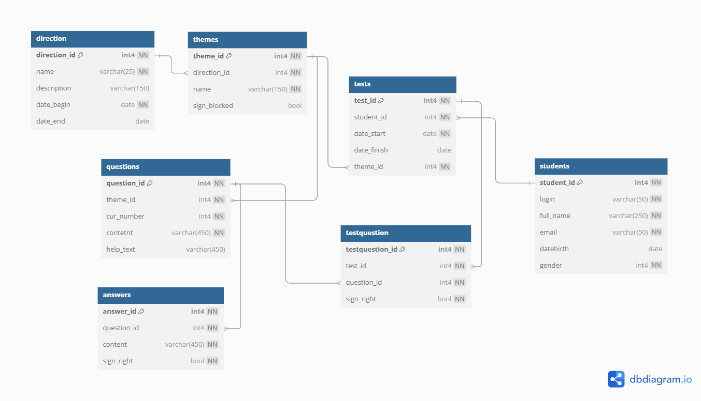

### Pet-проект "Система тестирования персонала"

Система может использоваться для оценки профессиональных знаний, навыков и компетенций работников.
В зависимости от целей, система может включать различные виды тестов: профессиональные, психологические, личностные и
другие. 

### Схема БД
